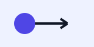

# Minimal Lab Project

This fixture demonstrates the version-1 authoring contract for startergen.

## Forward motion

The exercise source is available here:

{{ exercise("unicycle-dynamics") }}

!!! note "Learning goal"
    Keep the implementation readable and test the forward-motion case.

Inline math uses $v = r\omega$ and a matrix example follows:

$$
\begin{bmatrix} x \\ y \end{bmatrix}
=
\begin{bmatrix} 1 & 0 \\ 0 & 1 \end{bmatrix}
\begin{bmatrix} x \\ y \end{bmatrix}.
$$



```text
{{ exercise("unicycle-dynamics") }}
```
